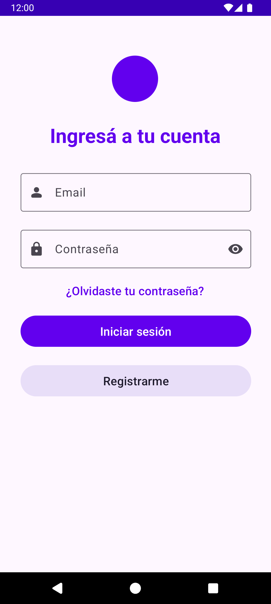
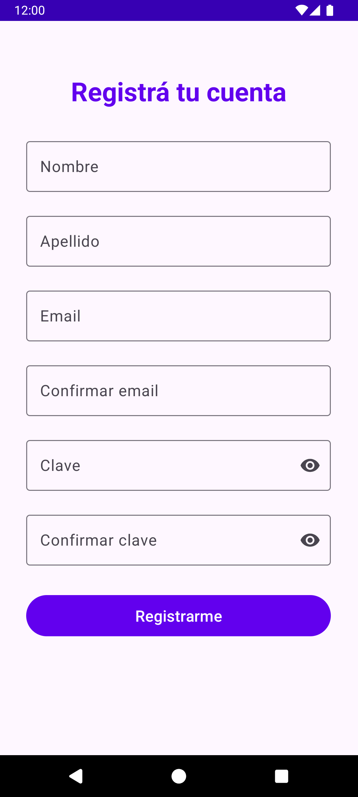
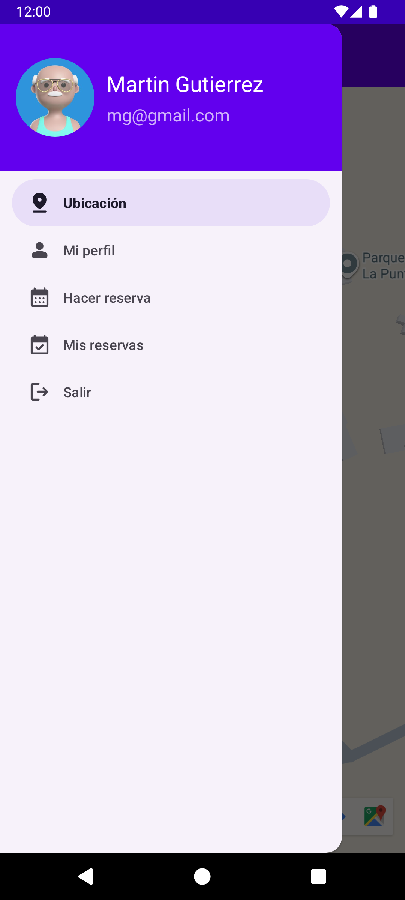
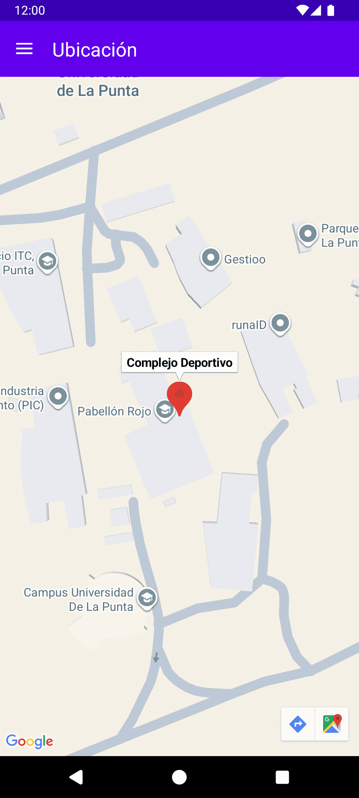
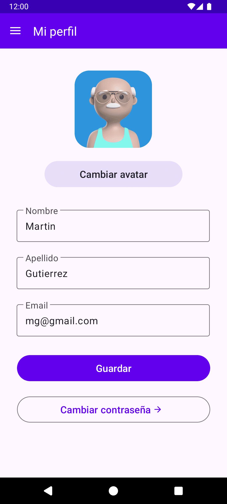
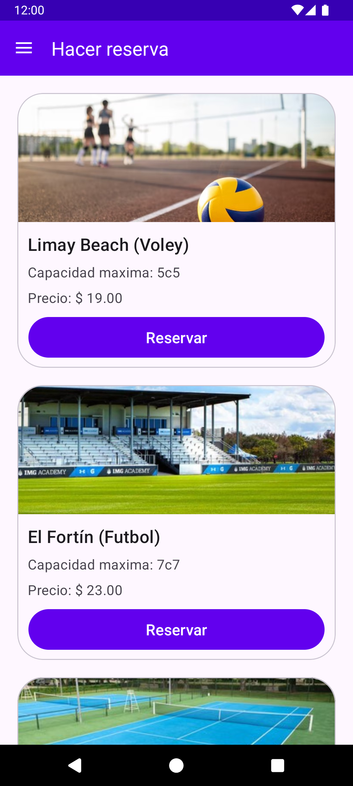
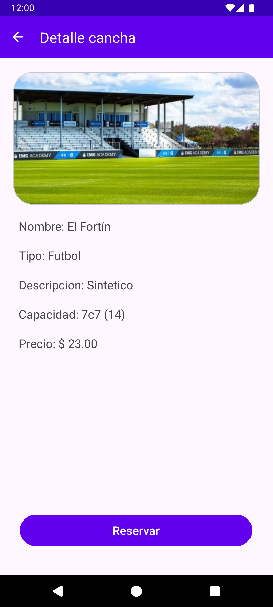
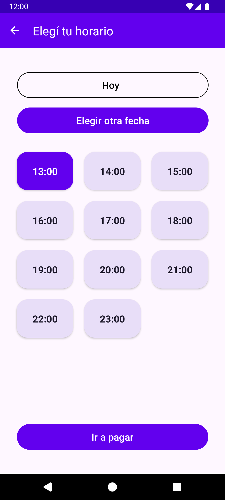

**APP:** https://github.com/kevinhuanca/complejo-deportivo-app

# Complejo Deportivo
Aplicación móvil para la gestión de alquiler de canchas deportivas, diseñada para facilitar a los usuarios la reserva, pago y consulta de disponibilidad de canchas. Desarrollada en Android con backend en .NET, la app busca optimizar la experiencia del usuario y mejorar la administración de espacios deportivos.

## Tecnologías utilizadas
- **Aplicación móvil:** Android (Java)
- **Consumo de API:** Retrofit
- **Backend:** ASP.NET Web API
- **Autenticación:** JWT (JSON Web Tokens)
- **ORM:** Entity Framework
- **Base de Datos:** MySQL

## Funcionalidades
- **Autenticación de usuarios:** Registro, inicio y cierre de sesión mediante sistema seguro con JWT.
- **Gestión de perfil:** Ver y editar datos personales del usuario (nombre, correo, etc.).
- **Consulta de disponibilidad:** Ver en tiempo real la disponibilidad de canchas por fecha y horario.
- **Pagos integrados:** Realizar el pago correspondiente a la reserva.
- **Historial de reservas:** Visualizar todas las reservas previas realizadas por el usuario.
- **Reserva de canchas:**
  - Seleccionar una cancha disponible.
  - Elegir el horario deseado.
  - Confirmar la reserva desde la app.

## Credenciales de prueba
- Cliente:
  - Usuario: `mg@gmail.com`
  - Contraseña: `123`

## Vista previa

| Inicio de Sesión | Registro | Menú | Ubicación |
|------------------|----------|------|-----------|
| 

 | 

 | 

 | 

 |

| Perfil | Reserva | Detalle | Horario |
|--------|---------|---------|---------|
| 

 | 

 | 

 | 

 |